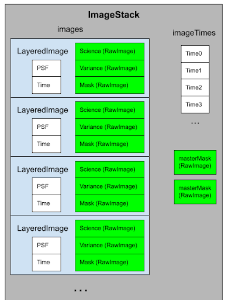

Overview
========

.. toctree::
   :maxdepth: 2

   input_files
   masking
   search_params
   output_files
   results_filtering
   testing

Running KBMoD
-------------
   
To run a search, KBMoD must be provided with

* appropriately pre-processed input data (see :ref:`Input Files`)
* appropriate search and filter parameters (see :ref:`Masking`)

The search is initiated via the :py:class:`kbmod.run_search.run_search` class and consists of several phases:

* Data is loaded from the input files as specified above (see :ref:`Input Files` for more details).
* Masks are applied to the images to remove invalid pixels (see :ref:`Masking` for more details).
* The shift and stack approach is used to search for potential trajectories originating from each pixel in the first image.
* The list of potential trajectories is filtered using various metrics.
* Remaining trajectories are clustered to remove duplicates. Only one trajectory per cluster is kept.
* The found trajectories are compared against known objects and matches are indicated.
* The found trajectories are output to result files for later analysis.

  
Data Model
----------

Kbmod uses an hierarchy of three nested data structures to store the image data over which it searches.

ImageStack
__________

The :py:class:`kbmod.search.image_stack` holds all of the image data for every time step. The main information stored is the images array, which holds one :py:class:`kbmod.search.layered_image` structure for each time step. The ImageStack also stores information that applies for all images such as a `globalMask` and an `avgTemplate`.

LayeredImage
____________

Each layered image holds the data from a single exposure, which consists of multiple layers including: a science image (the flux values), the variance image (representing the noise at each pixel), and MaskImage (representing per-pixel errors). In addition the :py:class:`kbmod.search.layered_image` tracks per-exposure information such as the PSF for the image and the time at which the image was taken.

RawImages
_________

A :py:class:`kbmod.search.raw_image` is the lowest level of data storage and effectively consists of a two-dimensional array of floating point values. These values can take on a variety of meanings depending on the use, including flux values, variance values, mask indicators, psi values, and phi values.

Reference/API
-------------

.. toctree::
   :maxdepth: 1

   ../run_search_referenceapi
   ../search_module_referenceapi
