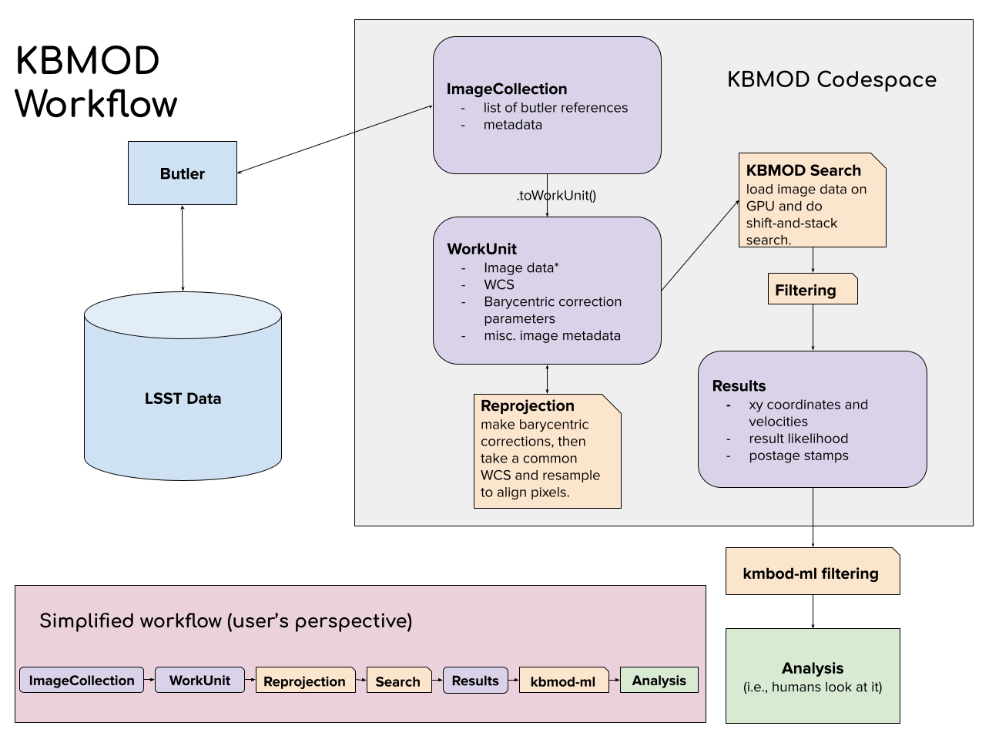

KBMOD Overview
==============

KBMOD is a shift and stack algorithm for detecting faint objects from a sequence of images. However the core shift and stack algorithm is only part of the broader system. KBMOD provides support for ingesting data, creating intermediate data formats, reprojecting images, running the search, filtering the candidates, and analyzing the results. The overall KBMOD workflow is shown in the figure below.

Ingesting Data
--------------

KBMOD provides multiple mechanisms for ingesting data. The preferred path is through a `Rubin Butler <https://pipelines.lsst.io/getting-started/data-setup.html>`_. However support is also available for ingesting data from raw FITS files. See :ref:`Input Files` for more details.

ImageCollection and WorkUnit
----------------------------

The :py:class:`~~kbmod.work_unit.WorkUnit` is the basic data unit for KBMOD. It includes all of the information needed for KBMOD to run, including images, time stamps, WCS, and metadata. WorkUnits can be created from the Butler via an :py:class:`~~kbmod.image_collection.ImageCollection` (which stores information about the data locations within the Butler) or from a set of raw FITS files.

Reprojection
------------

In order to shift and stack, KBMOD requires that all of the images align in pixel space. This is not always the case with arbitrary data. For example Rubin will produce images at arbitrary rotations. To address this, KBMOD provides the ability to reproject images to a common WCS.

In addition, we can account for the Earth's motion by reprojecting the images to a barycentric view. To do this we, need a guess distance of where the object is relative to the sun (e.g. 40 AU). KBMOD can then reproject the image to appear as though it was take from the barycenter. This improves linearization of the trajectory by removing the component of motion due to the Earth's motion.

Core Search
-----------

KBMOD uses a shift and stack approach for search. For details on the search algorithm and parametrization, see :ref:`Search Algorithm and Search Space`.

Filtering
---------

The shift and stack algorithm can generate a vast number of potential candidates. KBMOD pre-filters these in multiple stages, including using a sigma-G filter to remove outliers, filters on the count of observations and the likelihood of the trajectory, filtering on the properties of coadded stamps, and clustering of similar trajectories. For details on the filtering stages see :ref:`Results analysis`.

Analysis
--------

Candidates from the results file can be loaded and visualized with tools in the analysis directory. See the notebooks for multiple tutorials and guides.