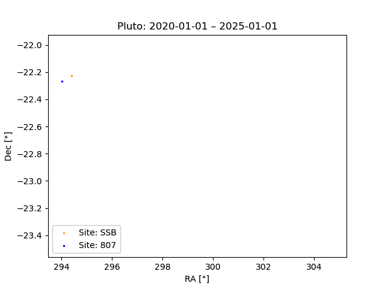

Reprojection
============

A KBMOD search assumes that each pixel of each image in the :py:class:`~~kbmod.core.image_stack_py.ImageStackPy` are aligned in the same RA and dec and space. To ensure that is the case in searches where the observations weren't pixel oriented deliberately, we use our reprojection utilities to transform the data.

Simple Reproject
----------------

This the first and simplest type of reprojection that we do. Given a :py:class:`~~kbmod.search.WorkUnit` with images of differing WCSs, choose a common WCS and reproject all the images to it.

The only requirement for this reprojection is that images that have the same observation time in the stack aren't overlapping (so any images taken by an instrument that has multiple detectors and tiling, such as LSST, are fine!). Please note that we don't currently check and filter based on how much of the original image ends up in the new reprojected stack, so if the images aren't overlapping in radec space you might have some mostly or even totally empty images.

To run a simple reprojection, take a :py:class:`~~kbmod.search.WorkUnit` and a common wcs and pass those into `reproject_work_unit`. For more info on the various configuration parameters for the job, see the :ref:`kbmod.reprojection` reference.

.. code-block:: python
    from kbmod.work_unit import WorkUnit
    from kbmod.reprojection import reproject_work_unit

    #  our toy WorkUnit we use for unit testing
    work_unit = WorkUnit.from_fits("../tests/data/shifted_wcs_diff_dimms_tiled.fits")

    # get the WCS of the first image in the stack of images.
    # to use as the global WCS.
    common_wcs = work_unit.get_wcs(0)

    reprojected_wunit = reproject_work_unit(
        work_unit, common_wcs
    )

Barycentric Correction
----------------------

Because KBMOD mostly searches for objects that are past Neptune and are therefore quite far away from us and center of the solar system, most of their apparent motion on the sky is caused by the parallax from the Earth moving around the sun, and not the actual orbit of the object. This unfortunately adds a lot of non-linearity to the trajectory and makes the objects much harder find.

Here's a diagram that better represents the problem, the blue line being Pluto's apparent motion on the sky while the orange is it's motion if parallax is corrected for:

To remedy this problem, we take our images and correct our observations to simulate what they would look like if the observation was taken from the solar system barycenter.

To accomplish this, we do the following:
 * take a guess distance from the barycenter and assume that there is a virtual object at that distance
 * find the distance from this virtual point to the actual observation point on earth.
 * "correct the parallax" by reprojecting the point into the ICRS coordinates that it would be at if it was actually observed from the barycenter.
 * randomly sample N points from a given image's WCS and repeat the process
 * fit a new WCS from these points
 * replace the image's old WCS with this new "explicit barycentric distance" (EBD) WCS.
 * run the reprojection code on this image and others with a common WCS in EBD space.
 * each pixel will be resampled into the new EBD space, and the parallax motion will be corrected for!

Here's a diagram describing this process:

.. image:: ../_static/brute_force_wcs_fitting.png

.. code-block:: python
    from astropy.coordinates import EarthLocation
    from astropy.time import Time
    from kbmod.reprojection_utils import transform_wcses_to_ebd

    # get the list of WCSes for each image
    wcs_list = work_unit.org_img_meta["per_image_wcs"]

    # observation point on Earth, Cerro Tololo in this case
    obs_point = EarthLocation.of_site("ctio")

    # convert the obstimes into astropy Time objects
    times = [Time(o, format="mjd") for o in work_unit.get_all_obstimes()]

    # returns the new EBD WCSes, plus the geocentric distances.
    reprojected_wcs_list, geo_dists = transform_wcses_to_ebd(
        wcs_list=wcs_list,
        width=100,
        height=100,
        barycentric_distance=40., # in AU
        obstimes=times,
        point_on_earth=obs_point,
    )

    # add the newly generated metadata to the work unit
    work_unit.org_img_meta["ebd_wcs"] = reprojected_wcs_list
    work_unit.org_img_meta["geocentric_distance"] = geo_dists

    # get a new common WCS in EBD space
    common_wcs = reprojected_wcs_list[0]

    # reprojection with the parallax corrected 'ebd' frame is now enabled!
    ebd_repr_work_unit = reproject_work_unit(
        work_unit, common_wcs, frame="ebd"
    )